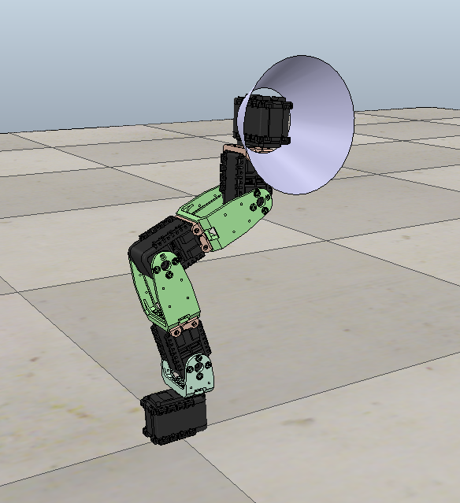

## The project
### Our goal
The initial idea was to create a robot able to move in a Luxo-style. Luxo is
the lamp in the famous 1986 Pixar's short-film *Luxo Jr.*, where two lamps
are playing with a ball. At some point in the film, the lamp seems to follow
the ball with head movements in a very *human*-way.

We would like to reproduce such a behavior with a robotic arm, equipped with a
camera as a captor, following a red ball. If we copy exactly Luxo's design,
the robotic arm would have 5 degree of freedom (5 revolute joints precisely).
This number is high enough to meet redundancy issues, and to quickly forget the
idea of an analytical solution due to its complexity.

So, we decide to head toward a machine learning of inverse kinematics.
Especially, we would like to apply the Matthias Rolf's goal babbling method,
which should have the advantage to be efficient in a 5-ish DOF case, and to
solve the redundancy issues with very efficient (an so *natural*) movements.
A description of this solution is given in the "Goal babbling permits direct
learning of inverse kinematics." section.

### Lamp design
The lamp design still has to be confirmed. (A copy of Luxo with 5 DOF or
another design ?)
Here is a prototype based on Luxo (you can find the corresponding .ttt in
model_1/) :

### "Goal babbling permits direct learning of inverse kinematics."
**Warning** : This section uses latex math formula integrated in a markdown
file. Make sure to use a renderer or previewer that support it (Pandoc for
  example).

This paper of Matthias Rolf, Jochen J. Steil and Michael Gienger, presents a
reinforcement learning method called goal babbling.
We have a robotic arm. The effector is at the point $x$. The arm can be
controlled by a command $q$. The resulting effector position from a command
is given by the forward kinematic function $f(q)=x$. We want to control
the arm, so we search a function $g(x)=q$ that would give us the right
command to reach a point $x$ (inverse model)

We don't know an analytic form of $f$, and even if we did, there would be
redundancy (multiple $q$ leading to the same $x$) and we won't be able to
easily calculate an inverse $g$. Therefore we want to use a machine learning
method, goal babbling here.

There is first an initialization phase :
* We start by choosing a set of point $\{x_k\}_{k\in 1..K}$. It can be
randomly (and/or uniformely) picked in the desired space area.
* We connect each point $x_k$ and $x_{k+1}$ by a linear motion with $L$
intermediate points. We have a new set $\{x_t\}_{t\in 1..KL}$
* We define an inverse kinematic function $g_\theta$ with a parameter
$\theta$ that will be updated during the learning. $g$ (and so the
corresponding parameter $\theta$) doesn't need to be known analytically. It can
be any algorithm or a neural network for example.
* We define $V$ command disturbance functions $E^v$ which will be added to $g$
during the learning phase. $E_v$'s must be chosen so that, for a given $R$,
$\|E_v(x_k)\|<R$.
* Choose a command $q_{home}$ which you want to be a "natural state" for the
robot. For a humanoid arm, it could be when the arm is fully relaxed for
example.
* We choose an initial $\theta_0$ for $g_\theta$ such as the result
$q_k=g_{\theta_0}(x_k)$ is always in a short area around the $q_{home}$
position.

Then we can perform the learning algorithm :

* for number of iteration
  * for each disturbance function in $\{E^v\}_{v\in 1..V}$
    * for each point in $\{x_t\}_{t\in 1..K.L}$
      * compute $E^v(x_t)$
      * compute $g_\theta^v(x_t) = g_\theta(x_t) + E^v(x_t)$
        * note : this step introduces randomness in the process and allow the
          discovery of new solutions.
      * compute $f(g_\theta^v(x_t))$
      * compute ${w_t^v}^{dir} = \frac{1}{2} (1+\cos(f(g_\theta^v(x_t)) -
        f(g_\theta^v(x_{t-1})), x_t - x_{t-1}) )$
        * note : this weight helps measuring the direction efficiency of the movement
      * compute ${w_t^v}^{eff} =
        \frac{\|x_t^v-x_{t-1}^v\|}{\|q_t^v-q_{t-1}^v\|}$
        * note : this weight helps measuring the amplitude efficiency of the movement
      * compute the total weight $w_t^v = {w_t^v}^{eff}.{w_t^v}^{dir}$
      * add the quadruplet $(f(g_\theta^v(x_t)), g_\theta^v(x_t), w_t^v, x_t^v)$ to
        the data set $D$
    * end for
    * add the home triplet $(f(q_{home}), q_{home}, 1, x_{home}=f(q_{home}))$ to the dataset $D$  
  * end for
  * update the parameter $\theta$ with the help of the dataset
    * note : any optimization method can be used, depending on the type of $g$
      function you choose
* end for
* $E(\textbf{M}) = \sum_{t=0}^{D-1} w_t\|\textbf{M}x_t-q_t\|^2$

There remains several question for our case :
* Form of $g$ (analytic, polynomial, neural network) ?
* Corresponding optimization method (gradient descent on the weighted error,
neural learning, evolutionary solution) ?
* How to build such a dataset ? Obviously, a real data obtained from a robot
  is not an option, then we need a simulation tool. But which one ?

### Benchmarking for the simulations method
A quick order of magnitude calculus show that about ten millions of examples
are needed for the learning phase. Such a number could only be reach with
simulation method. So, we need to know which one to use to be both efficient
and accurate. Pure kinematics ? Dynamics ? Which level of abstraction for the
simulator (home-made, v-rep ?) ?
